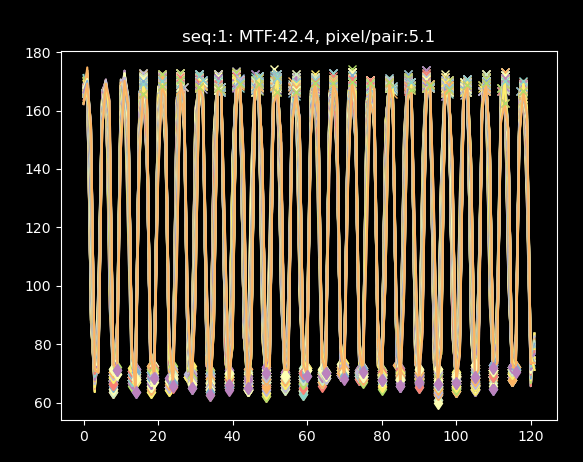
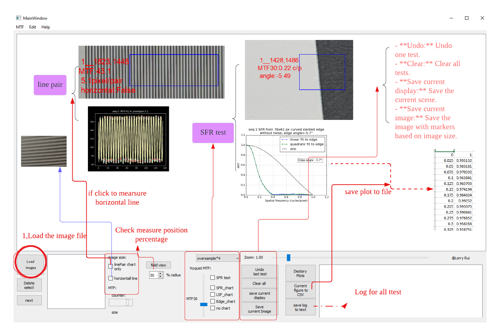

Copyright (c) 2022 lorry_rui , Fremont ,USA  

Permission is hereby granted, free of charge, to any person obtaining a copy
of this software and associated documentation files (the "Software"), to deal
in the Software without restriction, including without limitation the rights
to use, copy, modify, merge, publish, distribute,  and/or sell
copies of the Software, and to permit persons to whom the Software is
furnished to do so, subject to the following conditions:
 The above copyright notice and this permission notice shall be included in all copies or substantial portions of the Software.

 
*for image quaility test purpose like lens focus test   @  Lorry RUi  

=======================
Homepage: quickMTF
=======================
- [PyPI Package Page](https://pypi.org/project/quickMTF/)
- [Source Code](https://github.com/Lorrytoolcenter/quickMTF)
.. image:: https://github.com/Lorrytoolcenter/quickMTF/doc/linepair2.png
   :align: center

:github_url: https://github.com/Lorrytoolcenter/quickMTF

Main Features
================

- Quick calculation of MTF values for both linepair and slant edge MTF.
- Built-in GUI for image debugging and location picking.
- Plot MTF chart 
- GUI:
- Check measure position percentage feature 
- **Undo:** Undo one test.
- **Clear all:** Clear all tests.
- **Save current display:** Save the current scene.
- **Save current image:** Save the image with markers based on image size.
 
____________________________________	

Mail to: :lorryruizhihua@gmail.com  

This is a GUI Sample
====================

.. image:: https://github.com/Lorrytoolcenter/quickMTF/doc/manual.png

.. image:: doc/sfr.png
   :width: 600

sample code for using lib quickMTF

.. code-block:: python

   from quickMTF.quickMTF import quickMTF
   import cv2

   if __name__ == '__main__':
       test = quickMTF()
       ROI_width = 600
       ROIX = 1593
       ROIY = 1500
       image = cv2.imread("image.jpg")
       image = image[ROIY:ROIY+10, ROIX:ROIX+ROI_width]

       print(test.quicklinepairMTF(image, library='cv2'))  # linepair chart MTF value and pixels/line pair
       print(test.quicksfrMTF(image, cp=0.5))  # CP means cycles/pixel and out MTF value per c/p and slant angle
       print(test.quicksfrCP(image, mtf_indx=30))  # MTFindex means MTF and out Cycles/pixel per MTF value and slant angle

	
	
	
	
	
